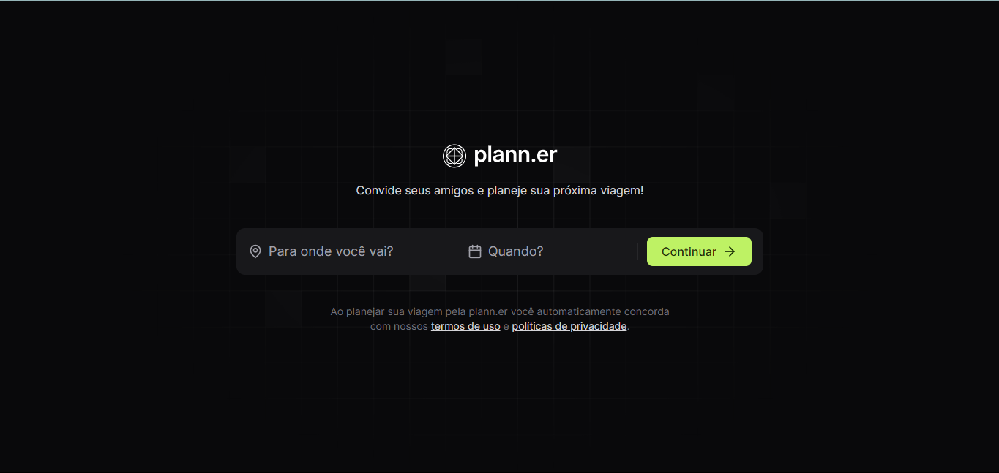
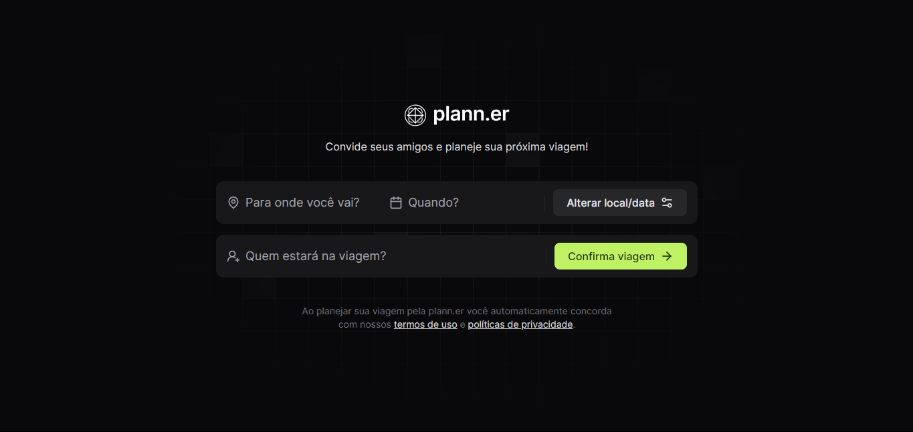
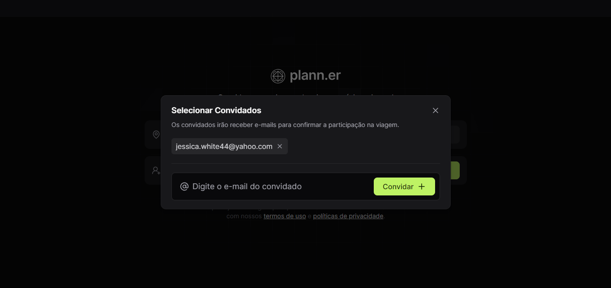

# Aplicação de Planejamento de Viagens



[](https://reactjs.org/)
[](https://www.typescriptlang.org/)
[](https://vitejs.dev/)
[](https://lucide.dev/docs/lucide-react/)

## Descrição

Esta aplicação permite que os usuários planejem viagens convidando amigos por e-mail e especificando detalhes como o destino e a data da viagem.

## Funcionalidades

- **Convite por E-mail:** Permite convidar amigos para a viagem enviando um convite por e-mail.
- **Modal de Convidados:** Abre um modal para gerenciar a lista de convidados.
- **Detalhamento de Viagem:** Campo para inserir o destino e a data da viagem.
- **Confirmação de Viagem:** Botão para confirmar a viagem.

## Tecnologias Utilizadas

- **React:** Biblioteca JavaScript para construção de interfaces de usuário.
- **TypeScript:** Superset do JavaScript que adiciona tipos estáticos.
- **Vite:** Ferramenta de build e desenvolvimento rápida e leve.
- **Lucide-React:** Biblioteca de ícones para React.

## Instalação

1. Clone o repositório:

    ```bash
    git clone https://github.com/seu-usuario/nome-do-repositorio.git
    cd nome-do-repositorio
    ```

2. Instale as dependências:

    ```bash
    npm install
    ```

3. Inicie a aplicação:

    ```bash
    npm run dev
    ```

## Utilização

1. Abra a aplicação no navegador.
2. Insira o destino e a data da viagem.
3. Clique em "Continuar" para confirmar o local e a data.
4. Adicione e-mails dos convidados clicando no botão "Quem estará na viagem?".
5. Convide amigos preenchendo o e-mail e clicando em "Convidar".

>[!NOTE]
> `main.tsx`

## Códigos Mutaveis

```tsx
import React from 'react'
import ReactDOM from 'react-dom/client'
import { App } from './App.tsx'
import './index.css'


ReactDOM.createRoot(document.getElementById('root')!).render(
  <React.StrictMode>
    <App />
  </React.StrictMode>,
)


```

>[!NOTE]
> `tailwind.config`

```tsx
/** @type {import('tailwindcss').Config} */
export default {
  content: [
    "./index.html",
    "./src/**/*.{js,ts,jsx,tsx}",
  ],
  theme: {
    extend: {
      fontFamily: {
        sans:"Inter"
      },
      boxShadow: {
        shape:
          "0px 8px 8px rgba(0, 0, 0, 0.1), 0px 4px 4px rgba(0, 0, 0, 0.1), 0px 2px 2px rgba(0, 0, 0, 0.1), 0px 0px 0px 1px rgba(0, 0, 0, 0.1), inset 0px 0px 0px 1px rgba(255, 255, 255, 0.03), inset 0px 1px 0px rgba(255, 255, 255, 0.03)",
      },
      backgroundImage: {
        pattern:"url(/bg.png)"
      }
    },
  },
  plugins: [],
}

```

 
 

## Estrutura do Projeto
- App.tsx: Componente principal que contém a lógica e os componentes da aplicação.
- index.css: Arquivo de estilos globais.

## Licença
Este projeto está licenciado sob a licença MIT. Veja o arquivo LICENSE para mais detalhes.

## Contato
Autor: Seu Nome
E-mail: seu-email@example.com
Agradecimentos
Agradecemos a todos que contribuíram para este projeto.
